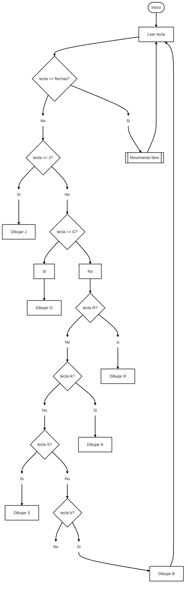

# Laboratorio-01-2025-I
#### Integrantes:
Juliana Gongora Rassmusen

correo:

Gerhaldine Alejandra Suárez Bernal

correo: gesuarezb@unal.edu.co

## Robótica de Desarrollo, Intro a ROS 2 Humble - Turtlesim
En el presente informe se describen los resultados obtenidos al utilizar ROS 2 Humble para controlar el simulador Turtlesim mediante programación en Python. Se desarrolló un script que permite desplazar la tortuga de Turtlesim mediante comandos de teclado predefinidos, gestionando tanto movimientos lineales como angulares. Asimismo, se implementó la funcionalidad de dibujar letras específicas a partir de la pulsación de teclas correspondientes.

### Objetivos
- Crear un nodo en Python capaz de controlar la posición de la tortuga mediante feedback, estableciendo la conexión entre ROS 2 y Python.

- Desarrollar un sistema para mover la tortuga utilizando comandos controlados por las teclas de flechas del teclado.

- Implementar un sistema en el cual, al presionar una tecla, la tortuga trace un camino que forme la figura de la letra correspondiente.
### Procedimiento realizado



```mermaid
---
config:
  theme: redux
---
flowchart TD
    A(["Inicio"]) --> B{"tecla==arriba? <br>"}
    B --> C["No"] & D["Si <br>"]
    D --> n1["Avanzar hacia adelante <br>"]
    C --> n2["tecla==abajo? <br>"]
    n2 --> n3["Si <br>"] & n4["No"]
    n3 --> n5["retroceder <br>"]
    n4 --> n6["tecla==derecha? <br>"]
    n6 --> n7["Si <br>"] & n8["No <br>"]
    n8 --> n9["tecla==izquierda?"]
    n7 --> n10["Girar a la derecha <br>"]
    n9 --> n11["Si <br>"] & n12["No"]
    n11 --> n14["Girar a la izquierda <br>"]
    n12 --> n15["Fin <br>"]
    C@{ shape: text}
    D@{ shape: text}
    n2@{ shape: diam}
    n3@{ shape: text}
    n4@{ shape: text}
    n6@{ shape: diam}
    n7@{ shape: text}
    n8@{ shape: text}
    n9@{ shape: diam}
    n11@{ shape: text}
    n12@{ shape: text}
    n15@{ shape: rounded}
