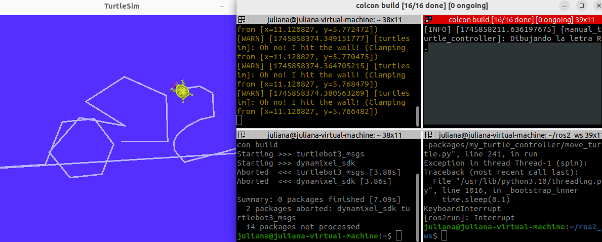
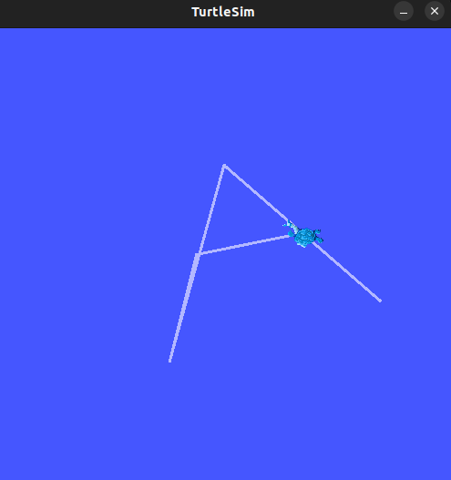
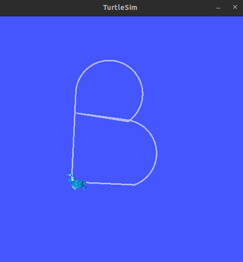
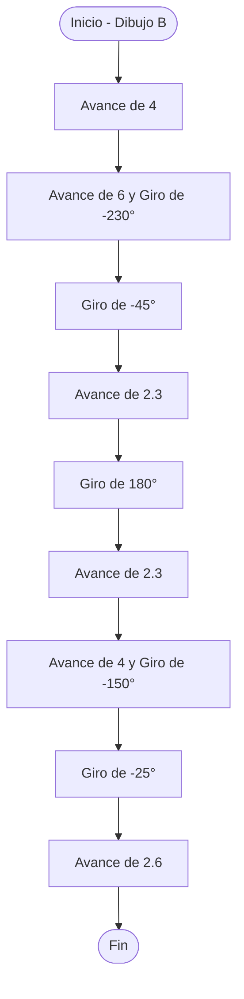
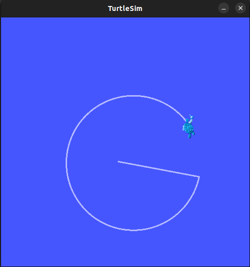
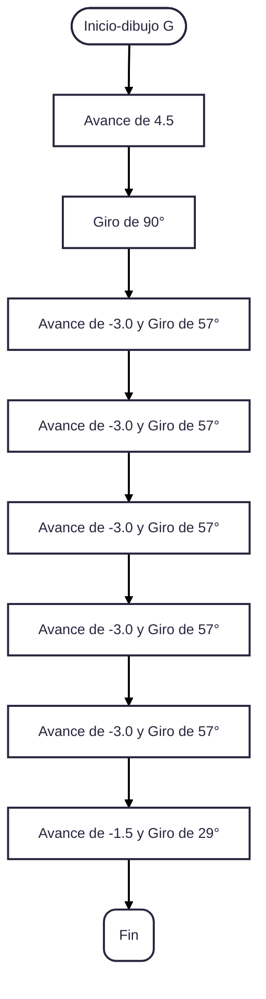
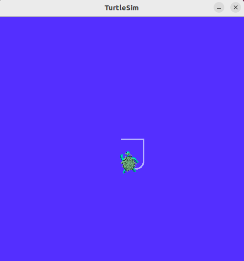
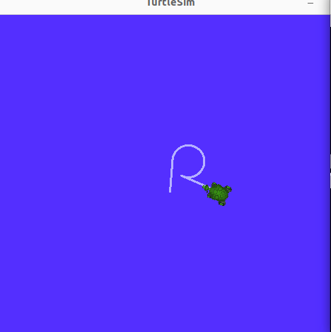
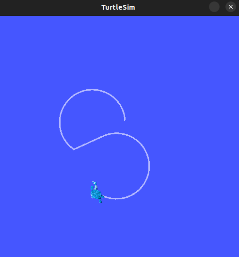

# Laboratorio-01-2025-I
#### Integrantes:
Juliana Gongora Rasmussen

correo: jugongorar@unal.edu.co 

Gerhaldine Alejandra Suárez Bernal

correo: gesuarezb@unal.edu.co

## Robótica de Desarrollo, Intro a ROS 2 Humble - Turtlesim
En el presente informe se describen los resultados obtenidos al utilizar ROS 2 Humble para controlar el simulador Turtlesim mediante programación en Python. Se desarrolló un script que permite desplazar la tortuga de Turtlesim mediante comandos de teclado predefinidos, gestionando tanto movimientos lineales como angulares. Asimismo, se implementó la funcionalidad de dibujar letras específicas a partir de la pulsación de teclas correspondientes.

### Objetivos
- Crear un nodo en Python capaz de controlar la posición de la tortuga mediante feedback, estableciendo la conexión entre ROS 2 y Python.

- Desarrollar un sistema para mover la tortuga utilizando comandos controlados por las teclas de flechas del teclado.

- Implementar un sistema en el cual, al presionar una tecla, la tortuga trace un camino que forme la figura de la letra correspondiente.
### Procedimiento realizado


Se presenta el diagrama de flujo implementado:


## Movimiento libre manual

Mediante una serie de condiciones basadas en la presión de las teclas correspondientes a las flechas del teclado, se busca obtener un control manual sobre la trayectoria seguida por la tortuga. Esta funcionalidad permite mover la tortuga en diferentes direcciones (arriba, abajo, izquierda, derecha) según las teclas presionadas, logrando un movimiento libre e interactivo.

```python

        while True:
            key = stdscr.getch()

            if key == ord('q'):
                self.get_logger().info('Saliendo del control manual')
                break

            # Flechas para movimiento manual
            if key == curses.KEY_UP:
                msg.linear.x = float(self.speed)
                msg.angular.z = 0.0
                last_key = curses.KEY_UP
            elif key == curses.KEY_DOWN:
                msg.linear.x = float(-self.speed)
                msg.angular.z = 0.0
                last_key = curses.KEY_DOWN
            elif key == curses.KEY_LEFT:
                msg.linear.x = 0.0
                msg.angular.z = float(self.angular_speed)
                last_key = curses.KEY_LEFT
            elif key == curses.KEY_RIGHT:
                msg.linear.x = 0.0
                msg.angular.z = float(-self.angular_speed)
                last_key = curses.KEY_RIGHT

```
```python


```

<p align="center">
  
</p>

### Criterios de diseño tomados para el movimiento manual

## Dibujo de letras
Se seleccionaron un total de 6 letras correspondientes a "J", "G", "R", "A", "S" y "B", las cuales fueron dibujadas mediante el desplazamiento de la tortuga. Este movimiento fue controlado mediante una combinación de funciones, donde linear.x regula la velocidad lineal, angular.z controla la velocidad angular y self.wait() maneja el tiempo de duración de los movimientos. La combinación de estos parámetros permitió que la tortuga dibujara formas que se asemejan a las letras objetivo.
```mermaid

```

---
<p align="center">
  
</p>

```mermaid
flowchart TD
    A(["Inicio - Dibujo A"]) --> B["Giro de 60°"]
    B --> D["Avance de 5"]
    D --> n1["Giro de 115°"]
    n1 --> n2["Giro de 180°"]
    n2 --> n3["Avance de 2.7"]
    n3 --> n4["Giro de 115°"]
    n4 --> n5["Avance -2.7"]
    n5 --> n6(["Fin"])
```

<p align="center">
  
</p>



<p align="center">
  
</p>



<p align="center">
  
</p>
```mermaid

``

<p align="center">
  
</p>
```mermaid

``

<p align="center">
  
</p>

....
### Criterios de diseño tomados para las letras


